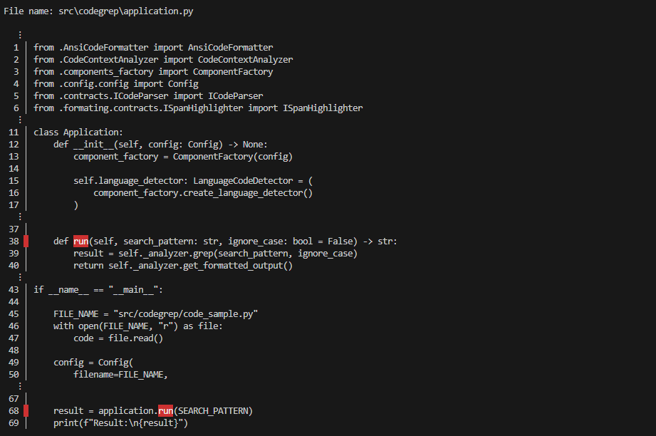
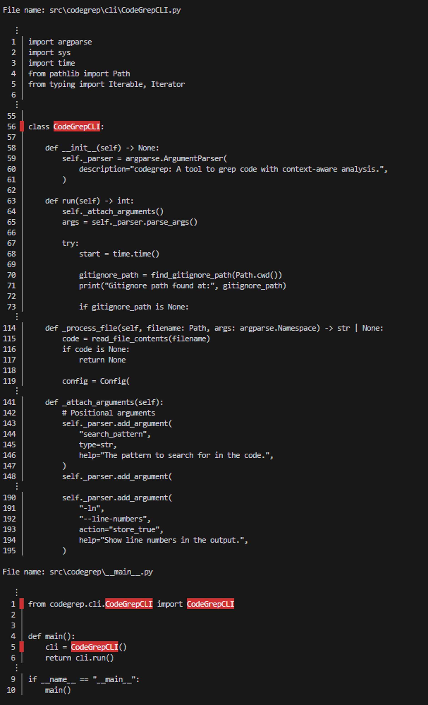

<p align="center">
	
</p>

---

<p align="center">
	<em>Code-aware searching and contextual highlighting for developers and AI tools.</em>
</p>

**Source Code**: https://github.com/richardvlas/codegrep

---

Codegrep is a composable code analysis toolchain that combines Tree-sitter parsing, regex search, and ANSI-color formatting to deliver precise results with meaningful context.

It is designed for developers and automated tooling that need fast, configurable code searches across large projects.

## Why Codegrep?

- **Context-aware**: Combine raw regex matches with syntax-aware parent and child scopes so you never lose sight of where a match lives.
- **Language savvy**: Uses Tree-sitter to detect and parse the language automatically, supporting dozens of popular languages out of the box.
- **Configurable output**: Choose colors, gutter markers, line-numbering, and padding to integrate with terminals, dashboards, or AI systems.
- **Composable architecture**: Swap in alternative matchers, highlighters, or formatters by extending the provided contracts.

## Installation

Install using `pip`:

```bash
$ pip install codegrep
```

## CLI Usage

The `codegrep` command line tool is the quickest way to search a file or directory.

```
Usage: codegrep [OPTIONS] FILENAME SEARCH_PATTERN

Options:
	--ignore-case               Perform case-insensitive matching.
	--colors                    Enable ANSI color highlighting.
	--color TEXT                Pick the highlight color (default: red).
	--line-numbers              Show 1-based line numbers alongside matches.
	--parent-scopes             Include parent scopes in the output.
	--child-scopes              Include child scopes in the output.
	--margin INTEGER            Number of padding lines around matches (default: 3).
	--help                      Show this message and exit.
```

## Library Usage

Use the high-level API to embed Codegrep into your own tooling:

```python
from codegrep.config import Config
from codegrep.application import Application

FILE_NAME = "example.py"
file_content = open(FILE_NAME).read()

config = Config(
    filename=FILE_NAME,
    code=file_content,
    colors=True,
    color="blue",
    line_numbers=True,
)
application = Application(config)
result = application.run("<your-search-pattern>")
```

Use the low-level API to build custom workflows:

```python
# Coming soon!
```

## Example Output

Searching for `run` keyword in a file path `src/codegrep/application.py` with the command:

```bash
codegrep run src/codegrep/application.py -i -c --color red --line-numbers
```

displays the following output:

<p align="left">
	
</p>

Searching across a directory `src/codegrep/` for the same keyword with:

```bash
codegrep run src/codegrep/ -i -c --color red --line-numbers
```

results in keyword matches displayed with context from multiple files.

<p align="left">
    
</p>

<p align="center"><i>Codegrep is <a href="https://github.com/richardvlas/codegrep/blob/master/LICENSE">MIT licensed</a> software.<br/>Built for curious engineers and the tools that help them.</i><br/>&mdash; ⚙️ &mdash;</p>
